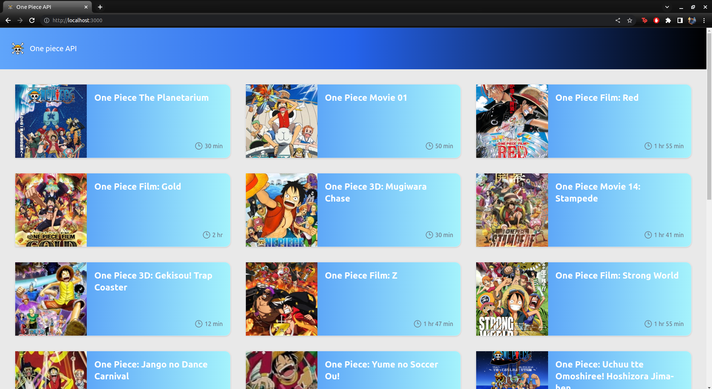
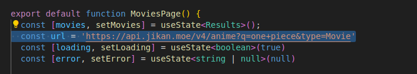

# one-piece-api

# Getting Started

## Prerequisites
**Node version 16.17.1**

You can download node from the official website by open the link: https://nodejs.org/es/download/

## Installation

Run the following command:
```bash
$ npm install
```
In case you need to modify server port you can do it by modifying server options on *vite.config.ts* file

## Running the app
Run the following command:
```bash
$ npm run dev
```

# Displaying data
Open [http://localhost:3000](http://localhost:3000) or the chosen port to view it in your browser.

You should see a screen displaying all One piece Movies


This page is rendered by *MoviesPage.tsx* file and fetch data from given url

