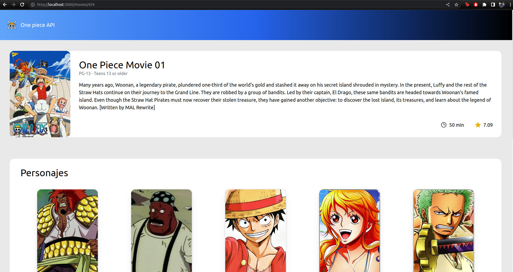
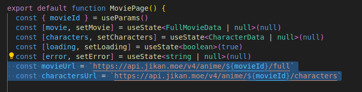
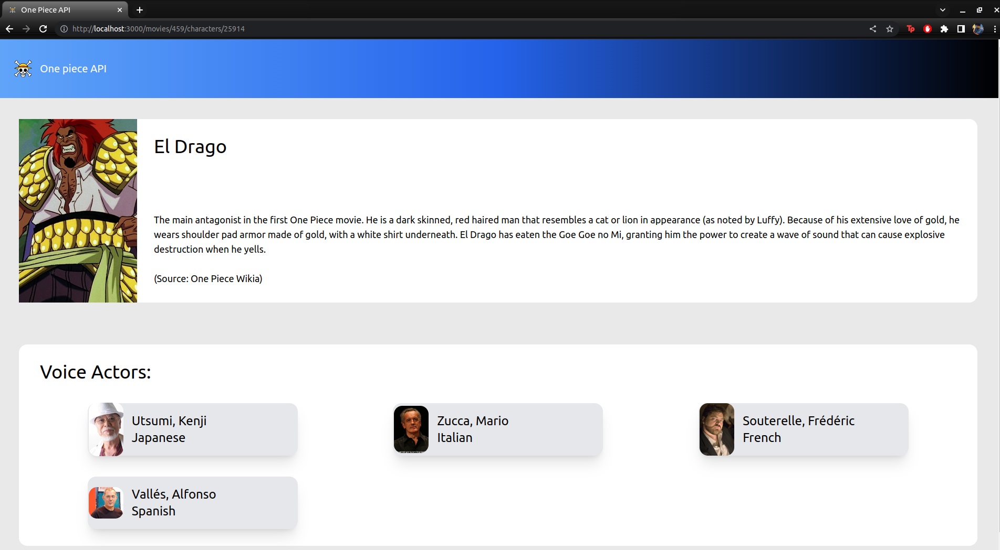
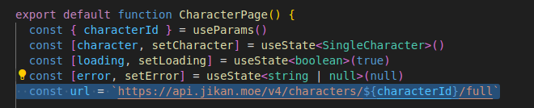

# one-piece-api

# Getting Started

## Prerequisites
**Node version 16.17.1**

You can download node from the official website by open the link: https://nodejs.org/es/download/

## Installation

Run the following command:
```bash
$ npm install
```
In case you need to modify server port you can do it by modifying server options on *vite.config.ts* file

## Running the app
Run the following command:
```bash
$ npm run dev
```

# Displaying data
### Homepage
-Open [http://localhost:3000](http://localhost:3000) or the chosen port to view it in your browser.

-You should see a screen displaying all One piece Movies


-This page is rendered by *MoviesPage.tsx* file and fetch data from given url


### Movie
- Click on any movie from homepage and you will be redirect to that movie page and more information about the movie will be displayed


-This page is rendered by *MoviePage.tsx* file and fetch data from given urls, also get the id from the uri to display chosen movie


### Character
- Click on any character from movie page and you will be redirect to that character page and more information about the character will be displayed


-This page is rendered by *CharacterPage.tsx* file and fetch data from given url, also get the id from the uri to display chosen character

